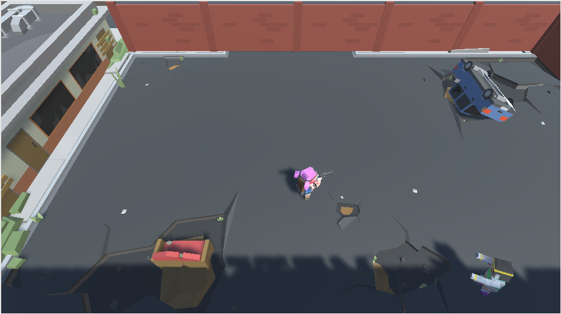
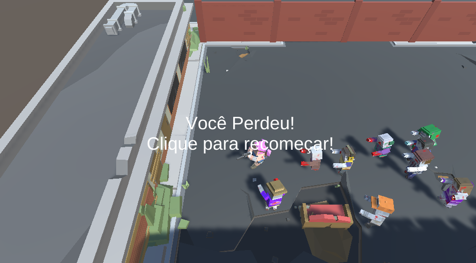

# Alura-UnityJogoSobrevivenciaZumbi

<h1><a href="https://gustavoprimolan.itch.io/zumbiesatack" target="_blank">LINK PARA JOGAR</a></h1>

<h1>Imagens do jogo</h1>



-------------------------------------------------------------------
<h1>Seção 01 - Cenário e Personagem Jogador</h1>


Preparando o Ambiente:

Vamos ver os passos importantes para instalarmos a Unity em nosso computador?
Vamos entrar no site da Unity em https://unity3d.com/pt/, aqui temos várias informações úteis sobre o Unity, vamos clicar no botão Obtenha O Unity no topo direito do site.

Aqui temos as versões disponíveis do programa, não se preocupe pois a versão grátis não tem nenhum diferença no programa para as outras versões. Vamos clicar em Experimente Personal.

Por fim aceite os termos de serviço e vamos fazer o download do programa clicando em Baixar Instalador.


Agora com o instalador em mãos siga com a instalação até o momento de escolher os componentes da Unity que deseja instalar, nesta hora mantenha as opções já marcadas e marque adicionalmente WebGL Build Support pois usaremos durante o curso e continue a instalação.

Aguarde agora o instalador fazer download e instalação de todos os componentes.

Dependendo do seu sistema operacional a Unity irá instalar o Visual Studio mas não se preocupe é só seguir com a instalação também deste programa normalmente.

Abra o Unity e faça login com a sua conta se você ainda não tiver uma você pode criar uma no site ou faça login com o Facebook ou Google.
Na próxima tela selecione que usaremos o Unity Personal e na tela seguinte marque que você não usará o Unity como profissional (I don't use Unity in a professional capacity), afinal ainda estamos aprendendo.

Pronto você já tem a Unity pronta para usar no curso!


Para saber mais - Conheça o Unity:

O Unity
O Unity é um Motor de jogo (Game Engine) para criação de jogos 3D e 2D, se tornando principalmente nos últimos anos uma referência no mercado principalmente pelos jogos que são lançados com o programa, jogos como: Superhot, Subway Surfers, Gang Beasts, Broforce, Rust, Fallout Shelter, Hearthstone, Pillars of Eternity, Temple Run, Ori and The Blind Forest, Dead Trigger, Angry Birds 2, entre outros que você pode conferir em https://madewith.unity.com.

Com a Unity somos capazes de produzir jogos sem termos que nos preocupar tanto com os aspectos computacionais porque ela nos entrega de forma dinâmica ferramentas para incluir imagens, áudios, modelos 3D e criação de códigos para o nosso jogo.

A quantidade de opções que a Unity oferece possibilita a criação de qualquer tipo de jogo é uma das maiores vantagens de utilizar a Unity, outra grande vantagem é a disponibilização de uma versão gratuita sem qualquer limitação de funções na Engine.

Há alguns serviços adicionais para a versão paga mas dentro da Engine a única diferença é que ao exportar seu jogo na versão gratuita, você terá uma tela com um texto informando que aquele jogo foi feito na Unity (Made with Unity) no momento em que o seu jogo estiver sendo carregado. Caso você queira trocar ou remover essa tela, é só escolher um plano de pagamento no site da Engine (https://store.unity.com/pt).

Para o nosso curso, a versão pessoal é suficiente.


No Unity quando vamos movimentar um objeto em uma Cena com objetos 3D temos três eixos X, Y e Z. Estes eixos tem grande importância pois eles regem todos os objetos da nossa Cena, nos ajudando na movimentação e rotação de objetos. Se eu quero movimentar um objeto para cima e para baixo que eixo é utilizado para fazer isto?

Cada eixo tem uma cor para representar sua letra sendo Vermelho para o eixo X, Verde para o eixo Y e Azul para o eixo Z. Como queremos movimentar para cima e para baixo utilizando o eixo Y Verde.
Agora que sabemos o que é uma Game Engine e temos o programa instalado faça download do projeto clicando aqui, extraia a pasta, vamos abrir clicando na opção Open no Unity e selecione a pasta do nosso projeto.
Entre na pasta Modelos3D > Contrucoes e selecione estes três objetos da nossa janela de projeto utilizando Ctrl (ou CMD no macOS) clicando em cada um deles.

Hotel_Estacionamento_Destruido
Hotel_Destruido
Hotel_Secundario_Destruido
Em seguida arraste os itens para a janela de Hierarquia (Hierarchy).

Arrastando objetos para Hierarquia

Como você pode ver os objetos já apareceram na sua janela de Cena (Scene). Comece agora a montar seu cenário utilizando a ferramenta de movimentação, que tem como atalho a tecla W, movimentando os objetos para posicioná-los. Após, vamos utilizar a ferramenta de rotação, que tem como a atalho a tecla E, e vamos rotacionar o Hotel_Secundario_Destruido colocando o valor de 90º em Y na Hierarquia para ter a posição correta no nosso estacionamento.

Montando Cenário

Agora que você já tem seu cenário principal do jogo criado, teste a fundo a manipulação de objetos tente movimentá-los para outros lugares, duplicar objetos e rotacionar para você evoluir tanto na manipulação quanto na navegação dentro do Unity.
Qualquer dúvida neste processo lembre de utilizar o fórum.


Há várias formas de navegar pelo Unity algumas são mais comuns que outras, como a demonstrada no vídeo que é a alternativa mais comum.
Abaixo seguem outras formas de navegação na cena além da demonstrada:

Modo Voo

Se você se segurar o botão direito do mouse na Cena, você poderá rotacionar a câmera. Então se você apertar algumas das teclas WASD você pode navegar como se estivesse voando pela Cena. Utilize as teclas Q e E para ir para cima e para baixo e segure Shift para aumentar a velocidade de Voo.

Movimentação com as Setas

Você pode usar as Setas? do Teclado para se movimentar pela cena da mesma forma que quando utiliza o modo de Voo. O Shift ?faz com que a movimentação seja mais rápida.

Materiais e Texturas no Unity
Os materiais e texturas são muito importantes quando estamos configurando objetos aqui dentro da Unity. Enquanto os materiais têm as propriedades de como o objeto vai ser exibido no nosso jogo, as texturas servem para dar outras propriedades, como adicionar Cor aos nosso objetos. As texturas são aplicadas em conjunto com os nossos materiais.
Depois que temos nossos objetos configurados é ideal salvar essa configuração. Como podemos fazer isto?

Quando criamos um Prefab nós salvamos essa configuração no nosso projeto para que possamos utilizá-la em várias Cenas do nosso jogo


Na Unity, quando queremos movimentar um objeto na Cena, podemos utilizar a ferramenta de movimentação, mexendo assim no Transform do objeto e em específico na parte de Posição. Agora quando queremos fazer este objeto se movimentar no nosso jogo, temos que fazer isto em comandos no nosso código.
Levando isto em consideração, nós criamos um Script e vamos fazer o personagem se movimentar para frente com um comando dentro do nosso Update, que comando seria este?
Correto! Lembre-se que o transform com T minúsculo acessa o objeto que tem o Script em questão e método Translate é usado para alterar a posição de um objeto passando um Vetor como direção e distância para onde quero me movimentar!

Agora seu personagem já está andando para frente e você aprendeu a utilizar os códigos para gerar este comportamento.
Além do Vector3.forward a Unity também tem outros tipos como Vector3.right, Vector3.left, Vector3.down, Vector3.up, Vector3.back que tal você substituir no código para testar estas novas opções e verificar para que lado seu personagem irá se movimentar?


Teclado para Movimentação
Quando vamos movimentar o personagem dentro da Unity, ela nos fornece uma gama de elementos para pegarmos o teclado do nosso jogador dentro dos comandos de Input.
Utilizando a solução que ela nos dá, queremos movimentar um jogador no eixo X para esquerda e direita. Que comando podemos utilizar para capturar tanto o aperto das setas do teclado da direita e esquerda quanto o das teclas A e D?
Quando queremos capturar o que o jogador apertou no teclado que faça referência com o eixo X para movimentar para a direita e esquerda usamos "Horizontal" e no eixo Z indo para frente e para trás utilizamos o "Vertical".


Movimentação por Segundo
Quando estamos movimentando o nosso personagem no Update, ele faz este movimento a cada Quadro (Frame) do nosso jogo, dando assim uma grande discrepância na movimentação dependendo de quantos Quadros por segundo o nosso jogo está rodando. O que podemos fazer para solucionar esse problema?
Quando multiplicamos por Time.deltaTime estamos fazendo o deslocamento do nosso personagem ser independente dos Quadros do nosso jogo, passando a se deslocar por segundo.

-----------------------------------------------------------------------------
<h1>Seção 02 - Animação, Colisão e Física</h1>


Movimentamos nosso personagem pelo código, mas o Modelo 3D dele não está se movimentando. Para isso nós utilizamos as Animações, com elas fazemos nosso modelo se mover de acordo com o comando que vamos dar. Levando isso em consideração e com um modelo já selecionado, quais são os passos para separarmos as várias animações de um personagem de uma forma que ficasse fácil de identificar cada uma?

Depois de marcar o início e término da animação é muito importante nomear para termos uma organização concisa do projeto ficando fácil de encontrar cada uma das nossas animações pelo nome.

Sistema Mecanim
Nós criamos o nosso controle de animação com parâmetros e o código para controlá-los.Mas quando soltamos a tecla que faz o jogador se mover, ele demora um tempinho para trocar da animação de movimento para a do personagem parado.
O que podemos fazer para solucionar este problema de transição?

Se deixarmos essa opção marcada, o nosso personagem vai terminar a animação atual para depois prosseguir para a próxima, dando assim uma impressão ruim de que o nosso jogo parece quebrado.

<h2>Colisão de Objetos</h2>
Na Unity quando queremos colocar colisão em objetos, temos que nos preocupar em como a forma dos colisores vai afetar nossa interação com estes objetos, tentando fazer sempre com que a colisão represente de fato a forma do objeto. Como podemos colocar colisão num objeto complexo como o Hotel_Estacionamento_Destruido e ter uma boa interação com esse objeto, que tem uma forma complexa, e ainda manter a performance do nosso jogo?

Correto! Mesclar vários tipos de colisores com formas primitivas ajustando-os para a forma do objeto é a melhor forma de ter uma boa colisão e manter a performance no nosso jogo.

<h2>Física na Unity</h2>
Quando queremos colidir com outro objeto na Unity, temos que ter um objeto com Rigidbody, o sistema de física da Unity. Porém ao colocar o Rigidbody em um personagem e movimentá-lo pelas setas, ele girou sem controle e caiu do nosso cenário. Qual seria a melhor solução para corrigir este problema?

Correto! Isso faria com que o nosso personagem não rotacione utilizando o Rigidbody, o que iria impedir o problema de acontecer.

<h2>Para saber mais - Documentação e Comentário de Código</h2>
O Unity tem uma documentação bem completa que você pode consultar quando necessário, por exemplo, caso você queira saber mais sobre todas as opções do Animator você pode consultar o manual (https://docs.unity3d.com/Manual/) e buscar por Animator:
https://docs.unity3d.com/Manual/class-Animator.html

Aqui você vê bem completo todas as opções que o Unity te fornece para utilização do Animator então sempre que tiver dúvidas sobre um Componente é um bom local de fazer uma busca.

Lembre-se que você pode traduzir a página para o Português clicando com o botão direito no browser e clicar em "Traduzir para o Português"

Outro link interessante de sempre buscar informações é a documentação da parte de códigos (https://docs.unity3d.com/ScriptReference/) então se eu necessito saber como utilizar um método do Animator como o SetBool é aqui que eu faço a busca:

https://docs.unity3d.com/ScriptReference/Animator.html

Em Public Functions você pode ver todos os métodos que a Unity te fornece para utilizar no Animator.

Inclusive se você quiser ver todos os métodos que o Unity fornece como o Update você pode fazer a busca por MonoBehaviour:

https://docs.unity3d.com/ScriptReference/MonoBehaviour.html

Em Messages temos todos os métodos que o Unity te dá pronto para utilizar nos seus códigos.

Outra dica muito interessante para quem está começando é utilizar comentários no código eles são utilizados para que você possa escrever no código o que quiser, em geral é escrito uma breve explicação sobre as linhas de código abaixo do comentário. Você pode escrever // no seu código e em seguida o que quiser, exemplo:

//Esta linha não será computada pelo computador serve somente como auxilio para o programador

Então no código que temos até agora no Personagem podemos incluir alguns comentários que facilitam quando você voltar neste Script depois de algum tempo como:

using System.Collections;
using System.Collections.Generic;
using UnityEngine;

public class ControlaJogador : MonoBehaviour
{

    public float Velocidade = 10;
    Vector3 direcao;

    void Update()
    {
        //Inputs do Jogador - Guardando teclas apertadas
        float eixoX = Input.GetAxis("Horizontal");
        float eixoZ = Input.GetAxis("Vertical");

        direcao = new Vector3(eixoX, 0, eixoZ);

        //Animações do Jogador
        if (direcao != Vector3.zero)
        {
            GetComponent<Animator>().SetBool("Movendo", true);
        }
        else
        {
            GetComponent<Animator>().SetBool("Movendo", false);
        }
    }

    void FixedUpdate()
    {
        //Movimentação do Jogador por segundo
        GetComponent<Rigidbody>().MovePosition
            (GetComponent<Rigidbody>().position +
            (direcao * Velocidade * Time.deltaTime));
    }
}

--------------------------------------------------------------------------------------------------------------
<h1>Seção 03 - Criando o Zumbi Inimigo</h1>

<h2>Inimigo seguindo o jogador</h2>

Quando vamos deslocar nosso inimigo temos que nos preocupar com a direção que vamos usar para deslocá-lo porque se passarmos uma direção incorreta ele pode não ter o comportamento esperado. Se queremos deslocar nosso inimigo para perseguir o personagem por todo o jogo , qual seria um vetor de direção válido para fazer esta ação levando em consideração que já temos o objeto do nosso jogador salvo numa variável de nome jogador ?

Vector3 direcao = jogador.transform.position - transform.position;
Correto! Temos que criar um vetor de direção que pega a posição do jogador mas leva em consideração onde nosso inimigo está posicionado.

<h2>Medindo Distância</h2>
O Unity nos fornece formas de calcular a distância entre dois pontos. Queremos calcular a distância entre duas posições a posição do jogador, que temos o objeto salvo numa variável de nome jogador, e a posição do nosso inimigo que é o objeto com o Script que estamos criando, depois queremos salvar o resultado numa variável. Qual seria um código válido para fazer isto?

float distancia = Vector3.Distance(jogador.transform.position, transform.position);
Correto! Estamos salvando o resultado numa variável do tipo float e calculando usando Vector3.Distance que calcula a distância entre duas posições.


<h2>Balas no Jogo</h2>
Com o método Instantiate nós criamos as balas no nosso jogo utilizando seu Prefab para gerar réplicas assim todas têm o mesmo comportamento.
Para movimentá-la utilizamos o Rigidbody através do código

GetComponent<Rigidbody>().MovePosition (GetComponent<Rigidbody>().position + transform.forward * Velocidade * Time.deltaTime);
no método FixedUpdate neste código utilizamos como forma de movimentar a nossa bala o transform.forward ao invés do anteriormente utilizado Vector3.forward. por que essa troca foi importante para o movimento da nossa Bala?

Porque o transform.forward aponta para frente em relação a rotação do objeto e não ao eixo padrão da Unity.
 
Correto! O transform.forward aponta para frente de forma local ao objeto levando sua rotação em consideração enquanto o Vector3.forward irá apontar sempre em relação ao eixo Z da Unity


----------------------------------------------------------------------------------------------------------------
<h1>Seção 04 - Interações entre os Personagens</h1>

<h2>Lançando Raios</h2>

Na Unity podemos utilizar o Physics.Raycast como forma de lançar um raio tendo uma direção e origem. Podemos através dele recuperar a colisão com objetos.
Porém, algumas vezes queremos limitar essa colisão à somente alguns objetos na nossa cena, podemos fazer isto utilizando qual tipo de variável?

LayerMask
 
Correto! Através da LayerMask podemos criar uma máscara de colisão, filtrando as colisões e ignorando objetos que não estamos interessados em fazer nosso raio colidir, utilizando as camadas (Layers) da Unity para isso.


<h2>Separando os objetos</h2>
Na Unity, quando vamos utilizar os métodos de colisão para criar uma lógica específica, temos que separar os objetos que vamos colidir. Qual seria a forma mais simples de testar se colidirmos com um objeto específico?

Utilizando Tags
 
Correto! Com as Tags a gente etiqueta um objeto e então podemos saber se esse objeto está colidindo testando um if com a tag que colocamos para o objeto.


<h2>Interface na Unity</h2>
O Unity nos fornece uma estrutura para criamos a Interface do nosso jogo, assim facilitando nosso trabalho em diversos aspectos. Toda vez que eu crio um dos objetos que ela me fornece como o Text, este objeto tem que estar dentro de outro objeto que tem um Component de rege a Interface, qual o nome deste Component?

Canvas
 
Correto! O Canvas é um Component do Unity que nos dá muito mais dinamismo no momento de criar Interfaces já que podemos simplesmente criar os modelos padrões que o Unity nos fornece como filhos do Canvas.


--------------------------------------------------------------------------------------------------------
<h1>Seção 05 - Finalizando o jogo</h1>

<h2>Gerando um número aleatório</h2>

Quando estamos criando um número aleatório no Unity utilizamos o Random.Range(), colocando um número mínimo e um número máximo.
Se queremos gerar um número qualquer entre 1 e 50, e guardar este valor numa variável do tipo int, como podemos fazer?
int numeroGerado = Random.Range (1, 51);
 
Correto! Está opção irá gerar um número aleatório de 1 até 50!

<h2>Criando um Gerador de Zumbis</h2>


É bem ruim termos que ficar criando Zumbis na mão certo?
Não seria melhor criarmos os Zumbis pelo código? Então vamos criar um novo código com o nome GeradorZumbis. Vamos adicionar esse código em um objeto vazio, assim como criamos a ponta da arma. Indo para Hierarquia em Create > Create Empty vamos jogar o Script, esse objeto que vamos nomear como Gerador de Zumbis. Lembre-se que, ao lado do nome do objeto, você pode clicar no ícone do quadrado e definir um ícone para este objeto vazio.

Agora no Script temos que criar algumas variáveis. A primeira é uma que irá valer para o Zumbi que será criado, a segunda é um contador de tempo, e a terceira é de quanto em quanto tempo vamos criar Zumbis.

public class GeradorZumbis : MonoBehaviour {

    public GameObject Zumbi;
    private float contadorTempo = 0;
    public float TempoGerarZumbi = 1;

    void Update () {

    }
}
Agora vamos preencher a variável Zumbi com o Prefab do Zumbi? Não faz mais sentido ter Zumbis na Hierarquia, porque eles serão criados por esse gerador. Então vamos aplicar o Prefab e deletar todos os Zumbis. Em seguida jogue o Prefab na variável.

Se tiver dúvidas é o mesmo que fizemos com a Bala.

Agora no Update temos que contar o tempo no contador. Qual é a variável que o Unity nos fornece para fazer as coisas ficarem em segundos, não é o Time.deltaTime?

Então no Update iremos fazer:

void Update () 
{
    contadorTempo += Time.deltaTime;
}
Lembre-se que o operador += faz a soma e já joga o resultado para ser salvo na variável. Agora estamos contando o tempo em segundos e temos que criar os Zumbis. Vamos então verificar se o tempo contado já chegou no tempo que definimos para criação de Zumbis da variável TempoGerarZumbi, vamos criar zumbis e vamos zerar o contador para recomeçarmos a criação.

void Update () 
{
    contadorTempo += Time.deltaTime;
    if(contadorTempo >= TempoGerarZumbi)
    {
        Instantiate(Zumbi, transform.position, transform.rotation);
        contadorTempo = 0;
    }
}
Só que agora precisamos corrigir um problema: quando o Zumbi é criado, ele não sabe mais quem é o Jogador. Então, assim como fizemos com o Zumbi, temos que criar uma Tag com o nome Jogador e colocar essa Tag no nosso Jogador.

E efetuar uma mudança no código do Start no método ControlaInimigo

```` void Start () { Jogador = GameObject.FindWithTag("Jogador"); }

Assim, o Zumbi é criado procurando o **Jogador** pela Tag anexada à variável `Jogador`. Esse é um dos usos mais comuns das Tags.

Agora outro ponto interessante é que é bem chato sempre sair o mesmo tipo de Zumbi não é mesmo? Vamos fazer uma modificação para concertar isso?

No código  `ControlaInimigo` do Zumbi, vamos fazer algumas modificações no `Start`. Primeiramente, quando vamos no *Prefab* do Zumbi e abrimos ele para ver os tipos, temos só um ativo, o *Prefab* que estávamos usando, certo? Vamos desativar este também. Assim nosso Zumbi não vai ficar com nenhum tipo ativo, e vamos ativar pelo código no método `Start` que acontece quando o Zumbi é criado.
void Start () { Jogador = GameObject.FindWithTag("Jogador"); int geraTipoZumbi = Random.Range(1, 28); transform.GetChild(geraTipoZumbi).gameObject.SetActive(true); } `` Aqui estamos gerando um número inteiro(int`), aleatório, de 1 a 27, já que o 28 (número máximo) não entra. 27 é a quantidade de tipos de Zumbis que temos. Depois, vamos no objeto do Zumbi e vamos pegar dos objetos-filho esse tipo aleatório e vamos ativar este tipo. Assim, nosso Zumbi sempre sai de uma forma diferente.


<h2>Procurando Objetos</h2>

No Unity podemos utilizar as Tags para marcar determinados objetos, depois podemos buscar um objeto no código por esta Tag.
Se eu crio um Script no Inimigo, e a partir dele quero buscar o objeto com a Tag Jogador e salvar na variável GameObject Jogador, qual seria uma linha de código para fazer isto?
Jogador = GameObject.FindWithTag("Jogador");
 
Correto! Aqui estamos buscando pela Tag corretamente.


Agora que já vimos bastante conteúdo, vamos fazer a refatoração de alguns códigos que fizemos para melhorá-los?
Em todos os códigos que utilizamos o GetComponent<T>(), é uma boa prática fazer isto somente uma vez e guardar este valor numa variável. Como exemplo, no código ControlaJogador estamos utilizando bastante GetComponent<Rigidbody>(), vamos então no topo do Script criar uma variável do tipo private Rigidbody rigidbodyJogador e no Start incluiremos a linha.

rigidbodyJogador = GetComponent();

Pronto! Agora toda vez que utilizamos o Rigidbody do jogador como na linha abaixo:

GetComponent<Rigidbody>().MovePosition
    (GetComponent<Rigidbody>().position +
    (direcao * Velocidade * Time.deltaTime));
Trocamos por:

rigidbodyJogador.MovePosition
    (rigidbodyJogador.position +
    (direcao * Velocidade * Time.deltaTime));


<h2>Atalhos na Unity</h2>
Na Unity, temos diversas ferramentas muito importantes para a manipulação de objetos, como a Ferramenta de Movimentação, Ferramenta de Rotação e a Ferramenta de Escala.
Qual o atalho de teclado para cada uma destas ferramentas nesta ordem?

W, E, R
 
Correto! Temos o W para a ferramenta de movimentação, o E para a ferramenta de rotação e o R para a ferramenta de escala!
